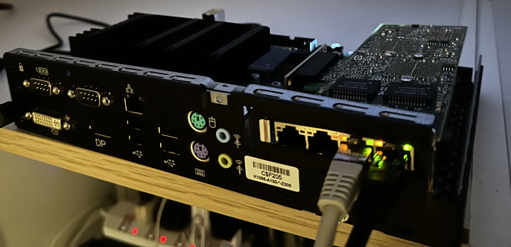
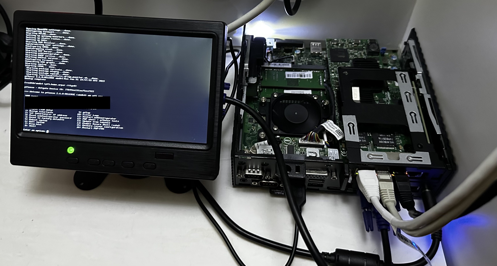
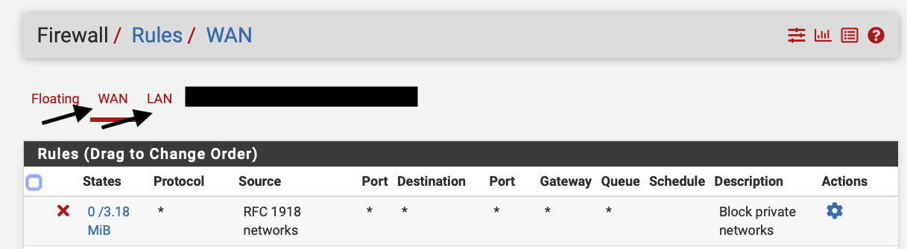
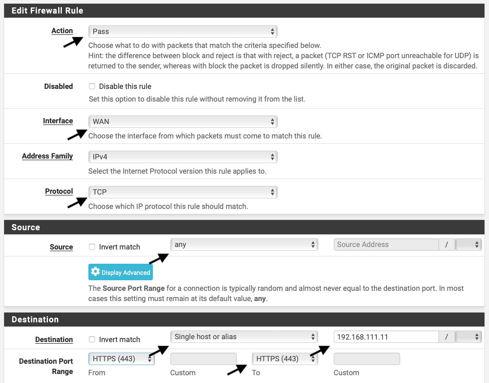
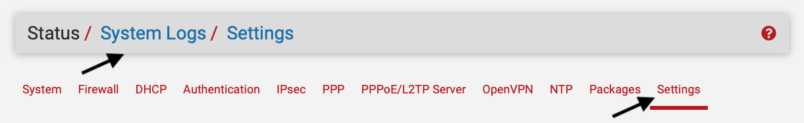
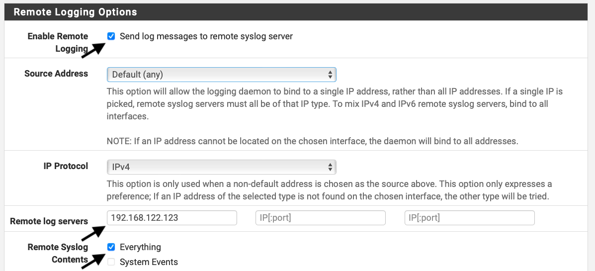
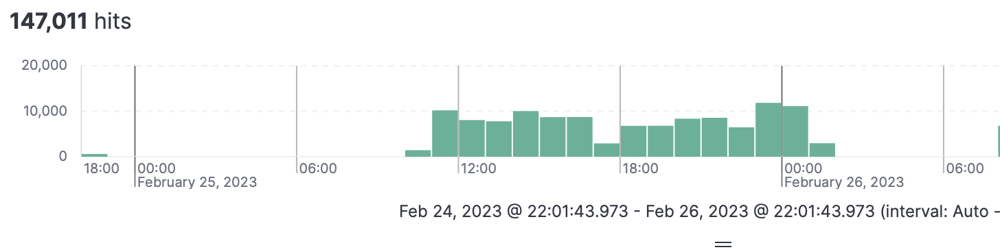
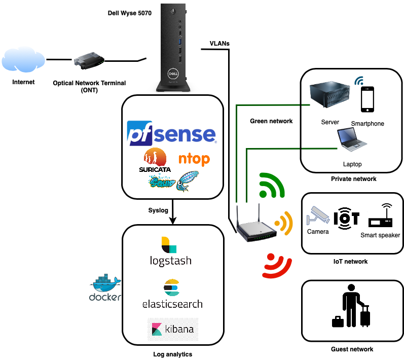

#Thin client hardware firewall


This article shows my journey on how you and I can protect a network on a small budget in terms of network isolation, communication flow control, monitoring connection events and network statistics, intrusion detection and prevention  as well as protecting your network against malware, unauthorised access and blocking of know bad actors via IOC (e.g. IPs).

In a previous project I used the Fujitsu S720 with OPNSense but the hardware itself was not sufficient to process ~600 Mbps of WAN traffic with all sorts of monitoring and protection services running on the device. The second version I build is based on a Dell Wyse 5070 with pfSense. The Wyse thin client makes use of a quad core CPU, 8 GB RAM and a 100 GB NVME and is able to transfer >600 Mpbs. The Wyse with all the components cost me around 240 USD (excluding the screen).


Fujitsu S720 OPNSense |  NEW Dell Wyse 5070 pfSense
:-------------------------:|:-------------------------:
   |  
|Processor:  AMD G-Series GX-222GC (2.20 GHz, up to 2.4 GHz, Dual Core, 1 MB, AMD Radeon™ R5E) | Processor: Intel Celeron quad-core processor
|Memory: 4 GB DDR3L RAM, expandable up to 8 GB | Memory: 8 GB DDR4 RAM, expandable up to 64 GB
|Storage: 128 GB solid-state drive (SSD) | Storage: 100 GB NVME


I first created a list of security requirements to outline what I want to protect and then a list of actions (see below) to ensure the fulfilment of these requirements. 

| No. | Action  | Description  | Implementation Action |
| --- | ------------------------------ | ---------------------------------------------- | ----------------------- |
| 1   | Keep your software up-to-date   | Regularly check for software updates and install them to ensure that your firewall has the latest security patches and features | Obvious 
| 2   | Use strong passwords           | Ensure that all passwords used on your firewall are strong and unique. This includes passwords for the web interface, SSH (ideally with key) access, and any other services that require authentication. | Obvious 
| 3   | Limit access to the firewall   | Only allow trusted individuals to access the firewall and limit their privileges to what is necessary for their role. | Obvious 
| 4   | Use firewall rules             | Create and implement firewall rules that control incoming and outgoing traffic to and from your network. | See chapter below
| 5   | Enable logging                 | Configure your firewall to log all incoming and outgoing traffic and regularly review these logs to identify any potential security threats. | Use ELK or Graylog, see section below
| 6   | Use VPNs                       | Use Virtual Private Networks (VPNs) to encrypt all traffic between remote users and your network. This helps to protect sensitive data and prevent unauthorised access. | Obvious
| 7   | Monitor the firewall           | Regularly monitor your firewall for any suspicious activity and take action as needed. | Use ELK or Graylog, see section below
| 8   | Disable unnecessary services   | Disable any services or protocols that are not required for your network to operate. This reduces the attack surface of your firewall and makes it more secure. | This is partly the case for a dedicated firewall but please see the section below for more details
| 9   | Implement IDS/IPS             | Use Intrusion Detection Systems (IDS) and Intrusion Prevention Systems (IPS) to detect and prevent malicious traffic from entering your network. | Snort or Suricata, see more in the section below
| 10  | Use two-factor authentication | Implement two-factor authentication (2FA) to add an extra layer of security to the web interface and other services that require authentication. | Obvious
| 11  | Block known malicious IP addresses | Block known malicious IP addresses using firewall rules to prevent them from accessing your network. | Can be done via the IPS in the firewall itself. See section below.
| 12  | Enable HTTPS                   | Enable HTTPS for the web interface of your firewall to ensure that all communication between the firewall and your web browser is encrypted. | Obvious
| 13  | Use strong encryption         | Use strong encryption methods, such as AES, for VPNs and other encrypted communication. | Use AES-256-GCM with e.g. OpenVPN
| 14  | Implement firewall rules                | Use firewall rules to restrict access to specific network resources. | See chapter below
| 15  | Configure network segmentation | Configure network segmentation to isolate different parts of your network and reduce the risk of lateral movement in the event of a security breach. | Segment different types of networks based on their sensitivity, purpose and function. See section below
| 16  | Use anti-virus and anti-malware software | Install anti-virus and anti-malware software on all devices on your network to prevent the spread of malware and protect against malicious software. | Squid proxy with ClamAV and it's content filtering. See section below
| 17  | Enable port security | Enable port security to restrict access to specific network ports and prevent unauthorised devices from accessing your network. | Might be not possible with the hardware I have but physical security in place
| 18  | Educate users | Educate users on best security practices and the importance of security, and encourage them to report any suspicious activity. | Done
| 19  | Test security regularly | Regularly perform penetration testing and vulnerability scans to identify and address potential security vulnerabilities. | Bigger topic, see section below

In the sections below I will address how to solve the actions above in a bit more detail.

## (4.) Use firewall rules 


Firewall rules are generally used to filter traffic based on criteria such as source and destination addresses, ports, and protocols. They are typically used to protect a network from unauthorised access, block unwanted traffic, and allow authorised traffic to pass through.


In pfSense each interface holds its own allow and deny rules (see below). The example rules below shows a rule that blocks traffic to IP addresses in private network ranges. This can be useful for enforcing security policies and preventing unauthorised access to private network resources from the public internet. 



This example shows on how to allow to expose a web server to the internet. Allowing different traffic flowing from one network to the other is quite straight forward in pfSense.


## (5.) Elasticsearch, Kibana, Logstash for all logs and events 
This topic needs actually its own article. I will follow up with more details in another project/document. Here are some details to start. 

-> Please understand that the provided docker ELK example should not be used in production and is not securely configured!!! <-

- Install docker
- Download the docker files from this repository 
- Run "docker-compose up" to start the containers
- Configure pfSense to send sys-logs to port 5140
- Access Kibana via the web browser at X.X.X.X:5601

You will need to create filters (see logstash.conf) for Logstash to filter the syslog events. I used the website grokdebugger.com for it. There are already many examples on GitHub, I also used some of them in my logstash testing configuration. 

This is one example of a rule I am using:

```
filter {
    grok {
        match => { "message" => "<%{POSINT:syslog_pri}>%{POSINT:version} %{TIMESTAMP_ISO8601:timestamp} %{HOSTNAME:hostname} %{WORD:program} %{INT:pid} - \[meta sequenceId=\"%{INT:sequence_id}\"\] \[%{POSINT:meta_id_1}:%{POSINT:meta_id_2}:%{POSINT:meta_id_3}\] %{WORD:alert_name} %{GREEDYDATA:alert_details} \[Classification: %{GREEDYDATA:classification}\] \[Priority: %{GREEDYDATA:priority}\] \{%{WORD:protocol}\} %{IP:src_ip}:%{NUMBER:src_port} -> %{IP:dest_ip}:%{NUMBER:dest_port}" }
    }                                                                                                                                                                                                                                                                                                         
}

```

Some things you might need to do when running it on your Machine for testing (I did it on a Mac):

**Open a port on MacOS**

```
sudo nano /etc/pf.conf
pass in proto tcp from any to any port 5140
sudo pfctl -f /etc/pf.conf
sudo pfctl -s rules
```

**Check if port is open:**

UDP
`
sudo nmap -p 5140 -sU 192.X.X.X
`

TCP `nmap -p 5140 192.X.X.X`

**Send test message**

UDP `nc -w0 -u 127.0.0.1 5140 <<< "Test message UDP"`

TCP `nc -w0 127.0.0.1 5140 <<< "Test message TCP"`


**Send logs to ELK**

See below on how to send all sorts of system events e.g. firewall block events via syslog to ELK



Finally all the logs are visible in Kibana



Other great project is [pfelk](https://github.com/pfelk/pfelk) which is a Elasticsearch, Kibana and Logstash solution which is already pre-configured to ingest and visualise pfSense logs.

## (8.) Disable unnecessary services 

Disabling unnecessary services is a good way to improve the security of pfSense. Here are the steps to disable unnecessary services in pfSense:

1. Log in to pfSense as an administrator.
- Click on the "Services" menu at the top of the screen.
- Review the list of available services, and determine which ones are not needed for your network.
- For each unnecessary service, click on the toggle switch to the right of the service name to disable it.
- Click on the "Save" button at the bottom of the screen to apply the changes.
- Some examples of services that may be unnecessary for your network and can be disabled include:

- UPnP and NAT-PMP: These services are used to automatically configure port forwarding.
- DHCPv6 and RA: These services are used to automatically configure IPv6 addresses, but may not be needed if you are using static IPv6 addresses or if IPv6 is not used at all.
- Dynamic DNS: This service is used to automatically update DNS records.
- Wake on LAN: This service is used to wake up computers on the network remotely.
- Also all the services which are used in this article to monitor and protect could add a security risk but additional benefit weighs it out in my case.

By disabling unnecessary services, you can reduce the attack surface of your pfSense firewall and improve its overall security.

## (9.)  Implement IDS/IPS

Both OPNSense and pfSense support Suricata and pfSense even support Snort and zeek additionally. 

Suricata is a high-performance network threat detection engine that can be used for intrusion detection, network security monitoring, and network protection. It is known for its fast performance and comprehensive feature set, including support for IPS mode, full IPv6 support, and integration with multiple data sources.

Snort, on the other hand, is a well-established IDS that has been around for many years. It is known for its flexibility and customisation options, with a large community of users who have created many custom plugins and rules. Snort also supports both IPS and IDS modes, and is easily integrated with other security tools such as syslog servers and firewalls.

Zeek, previously known as Bro, is an open-source network analysis tool that provides security and network visibility. It operates as a passive network sensor, meaning it only observes network traffic without making any changes to it. Zeek is used to monitor, analyse, and understand network traffic in real-time, with a focus on security.

Ultimately, the choice between Suricata, Snort, and Zeek will depend on your specific needs and requirements. If you prioritise performance and comprehensive features, Suricata may be the better choice for you. If you prefer customisation options and a large community of users, Snort may be a better fit. Zeek, on the other hand, is a passive network analysis tool that provides security and network visibility, with a focus on security. It provides a wealth of information about network activity and can be used to identify security threats and anomalies, detect network intrusions, and support incident response and forensics.

I will chose this time Suricata because of it's performance and comprehensive features.

**How to install and configure Suricata**


1. Log in to the pfSense web interface and navigate to the Package Manager.
- Search for "Suricata" in the available packages and click the "Install" button for the "Suricata Intrusion Detection System" package.
- Once the package is installed, navigate to Services > Suricata.
- Click the "Global Settings" tab and configure the basic settings for Suricata, such as the interface on which to listen for traffic, the logging options, and any other desired settings.
- Navigate to the "Suricata Alerts" tab and configure the alert settings, such as the email notification settings, the alert logging options, and any other desired settings.
- Click the "Save" button to apply your changes.
- Navigate to the "Suricata Rules" tab and select the rulesets you want to enable. You can also update the rulesets to ensure you have the latest rules.
- Click the "Save" button to apply your changes.
- Start the Suricata service by navigating to Services > Suricata and clicking the "Start" button.
- Verify that Suricata is running by navigating to the "Suricata Status" tab and checking the status of the service.


## (11.) Block known malicious IP addresses

In Suricata, you can block known malicious IP addresses by using the build in threat intelligence of "ET open emerging threats rules", Snort rules, Feodo tracker, Abuse.ch (IP and SSL rules) plus custom rules and IPs which can be black listed.

All this can be configured under services -> Suricata -> "Global Settings" 

## (15.) Configure network segmentation

Segmenting different networks for security is an important aspect of maintaining the overall security of your system. By dividing your networks into separate and distinct segments, such as a green network for private devices, an orange network for IoT devices, and a red network for guest devices, you can better control and manage access to your resources and data (see below). This helps to reduce the risk of security breaches, minimise the impact of security incidents, and ensure that sensitive information is protected.

Segmenting networks can also help to simplify security management and administration by allowing you to apply different security policies and configurations to each segment. For example, you may have different security requirements for your private network compared to your IoT or guest networks. By having separate segments, you can apply the appropriate security controls to each network, based on its specific needs. Technically this can be done by using different physical interfaces on the firewall or via VLANs. I use both. 




## (16.) Use anti-virus and anti-malware software 

How to use pfSense to protect against malware:


1. Use Suricata, block malicious IP addresses: pfSense can block malicious IP addresses by using blacklists, such as the Emerging Threats or Snort rulesets. These blacklists are automatically updated to provide the latest protection against known malware threats.
- Use Content Filtering (Squid proxy): pfSense has a built-in content filtering / malware system that allows you to block access to websites that are known to spread malwar or host malicious content. Furtuher more content is scanned by ClamAV.
- Use HTTPS Inspection (Squid proxy): pfSense can be configured to inspect HTTPS traffic and block malicious certificates, ensuring that your network is protected from SSL-based attacks.

The Squid proxy can be used for the following: 

- Protection against viruses and other malware: Squid proxy can analyse web traffic and filter out harmful content like viruses and Trojan horses. 
- URL Filtering: Squid proxy can prevent access to URLs that are known to be linked to unsuitable content, phishing websites, or websites with harmful code. 
- Web content can be filtered using predetermined criteria, such as keywords, file formats, or MIME types. This may be helpful for upholding corporate policies or adhering to regulatory requirements. 
- Access Control: With Squid proxy, access to web resources can be restricted depending on a number of factors, including IP address, user identity, and authentication status. This may aid in limiting unauthorised access to private data. 
- Traffic Surveillance

**Install Squid**

1. Navigate to System -> Package Manager: This will open the pfSense Package Manager, which allows you to install and manage packages on your firewall.
- Search for Squid: Use the search bar to search for Squid and select the package from the results.
- Install Squid: Click the "Install" button to start the installation process. The installation may take a few minutes to complete.
- Configure Squid: Once the installation is complete, navigate to Services -> Squid to configure Squid. 
- Go to local cache and press "clear disk cache now" and save
- Create a certificate (see below)


**How to create a CA**

A certificate is needed to use the "man-in-middle" function of a Squid. This enables the firewall to analyse encrypted web traffic 

1. Navigate to System -> Cert Manager: This will open the pfSense Certificate Manager, where you can manage digital certificates on your firewall.
- Create a new CA: Click the "CAs" tab, then click the "Add" button to create a new CA.
- Configure the CA: Fill in the fields with the appropriate information, including the name of the CA, the method of signing, and the validity period.
- Save and Apply Changes: Click the "Save" button to save your changes and apply them to your firewall.
- Import the CA Certificate: To use the CA with other applications, you will need to import the CA certificate into your browsers and/or your OS. Export it from pfSense and import it to your PC.


## (19.) Test security regularly 

Regular testing of a firewall is an important part of maintaining its security. Here are some actions that can be taken to test a firewall regularly and improve its security:

1. Conduct regular vulnerability scans: Use a vulnerability scanner to identify any vulnerabilities in the firewall configuration and underlying system.
- Conduct regular penetration testing: Hire a professional penetration consultant to simulate attacks against the firewall to identify any weaknesses or vulnerabilities.
- Monitor firewall logs: Review the firewall logs regularly to identify any unusual traffic or suspicious activity that may indicate an attempted attack.
- Review firewall rules: Regularly review the firewall rules to ensure that they are still necessary and properly configured. Remove any rules that are no longer needed.
- Test firewall failover: If the firewall has a failover mechanism, test it regularly to ensure that it is working as intended.
- Keep firewall software up to date: Regularly update the firewall software to ensure that any known vulnerabilities are patched.
- Conduct regular user training: Provide regular training to users on the proper use of the firewall and safe network practices.

By taking these actions, you can identify and address any security issues in the firewall and improve its overall security posture. Regular testing can also help you stay up to date with new threats and emerging attack techniques.