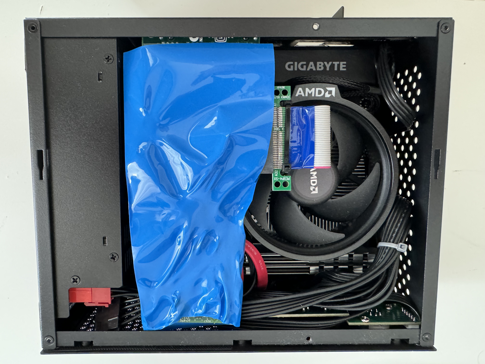

# Building a powerful 3.8 liters mini server

Constructing and operating my personal infrastructure has consistently been a source of enjoyment for me. The objective of this year's server project is to assemble a cost-efficient mini PC equipped with a minimum of 64GB of RAM and multiple high-speed disks.

Last year, I embarked on a project to create a network-attached storage (NAS), a virtual firewall, and a docker container setup using readily available components. However, this setup was housed in a considerably large casing (see below).

Acquiring an additional server will facilitate the establishment of high availability (HA) in forthcoming projects. This new server, with its increased RAM, will not only support a broader range of services but also potentially enable HA implementation across different physical locations in the future.

## Last year NAS server project

Details about last year's project can be found [here](https://github.com/tobias-klingel/Buidling-your-own-infrastructure-/tree/main/Building%20a%20TrueNAS%20server).

 

## This year's powerful mini server

Tiny in comparison but more power |  Sneak peak of the finished server
:-------------------------:|:-------------------------:
 |

# Building the hardware

**Components**

Parts |  Cost Including Shipping (USD)
:-------------------------:|:-------------------------:
64GB (2x32GB) RAM DDR4 3200 | 112.22
Gigabyte A520I AC mini-ITX |119.33
AMD Ryzen 5 5600G 6-Core 12-Thread | 134.76
1TB NVMe PCIe M.2 2280 (Read/Write 3,000/2,600 MB/s) | 73.77
2x 512GB SATA M.2 |85.17
2x MSATA SSD To 2.5' SATA adapter card module |3.62
2x short 15cm SATA data cable | 2.77
500W 1U PSU | 39.82
A09 HTPC Computer Case Mini ITX | 31.25
PCIe extension riser cable | 4.09
1m/pack PVC blue isolating heat shrink tube | 2.54
Total costs: |609.34 USD

There is no comparable system on the market that is as compact, features at least 64 GB of RAM, multiple Ethernet ports, an NVME slot, and several SATA disks, all at an affordable price. Comparable systems on Amazon cost between 700 and 900 USD, yet they still lack multiple Ethernet ports, typically include only one disk and have a weaker CPU.

## The process

#### Too many components for not a lot of space!

 ||
:-------------------------:|:-------------------------:|:-------------------------:

#### Packing in two extra SATA M.2 512GB drives

I used two SATA adapter card modules, each with a 512GB M.2 SATA module, wrapped in isolating heat shrink tubing to avoid any shorts.

 ||
:-------------------------:|:-------------------------:|:-------------------------:

#### Adding a 4x 1 Gigabit PCIe Ethernet card
To make sure all network applications such as a virtual firewall have enough Ethernet interfaces this project got an Intel Pro/1000 VT Quad Port PCIe card.

 ||
:-------------------------:|:-------------------------:|:-------------------------:

## Finished Proxmox server!!!

