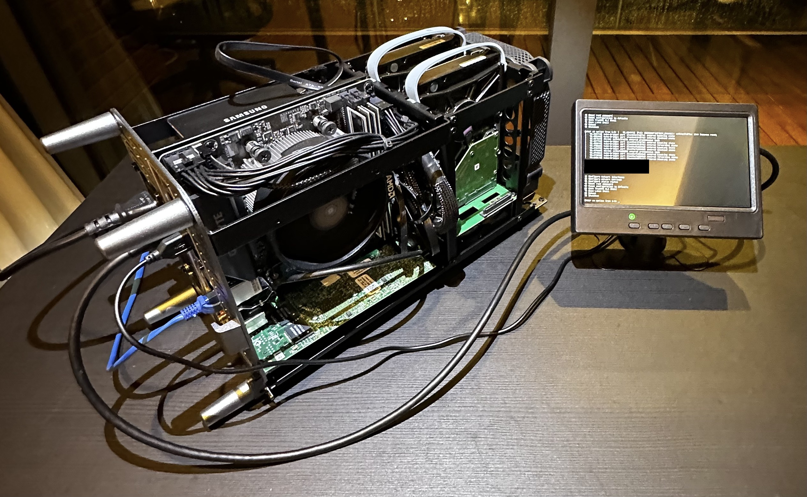
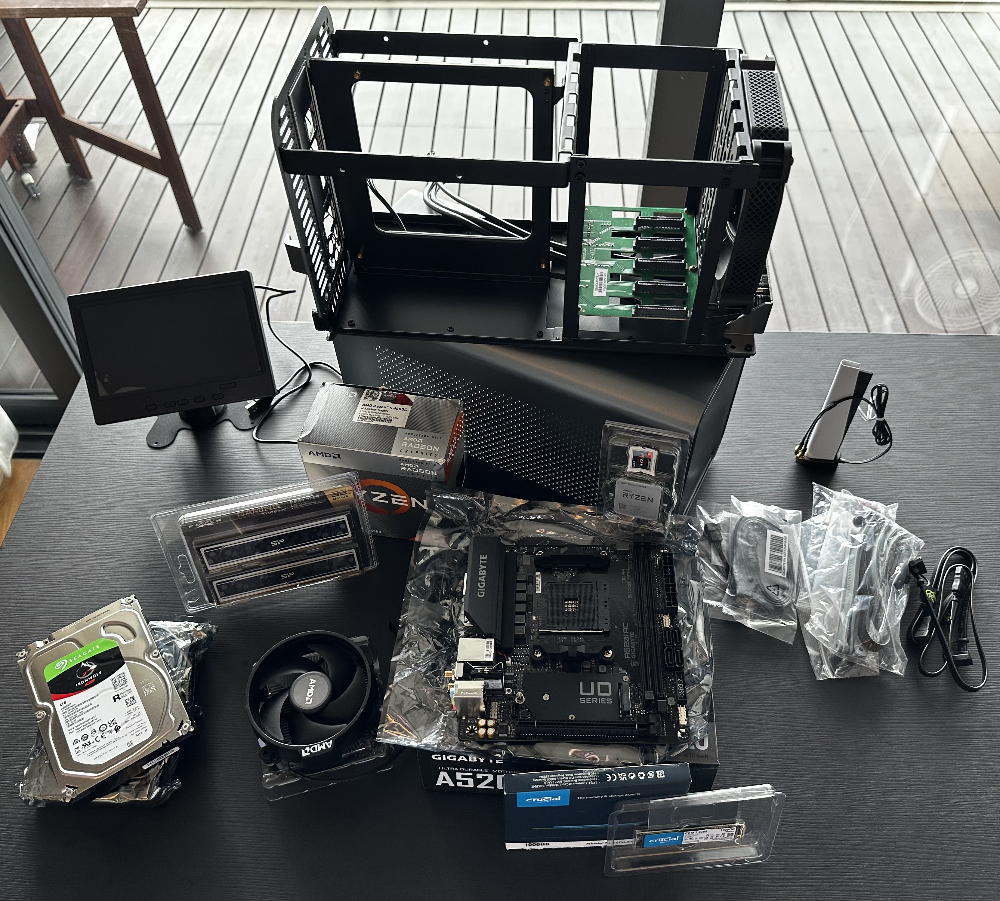
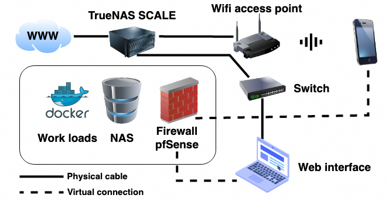
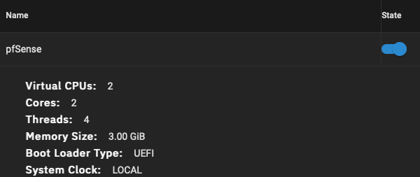
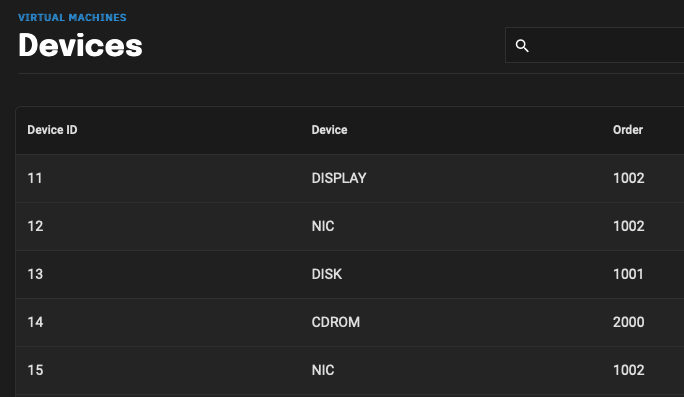

# Building your own cloud / home server

In this project I wanted to build a server to act as a home storage server, docker container host and virtual machine host.

I have chosen a NAS mini-ITX case with needed components (see below). The trickier part was how should the OS stack ideally be setup? My first idea was a type 1 hypervisor and then run on the top of that all the services I need. ESXi was the first solution which came to my mind which I also used before. The problem it is does not support the four port network card I am using and it seems there is also not a free version available anymore.

For me it looks like the ideal solution is TrueNAS. See more details in regards to this below.

**Functional requirements**

* Able to host and run docker container
* Able to run VMs
* Able to act as NAS 
* The OS running it should be free, open source and/or very affordable

**Hardware requirements**

* Small and compact case
* Small screen for debugging 
* Several network ports for potential firewall solution
* Fast (write, read, access) storage e.g. NVME for VMs and containers
* Extendable storage in the X-TB area e.g. mechanical SATA drives

## Building the hardware
**Components**

* SilverStone SST-EX500-B 500 W 80 Plus
* Silicon Power Value Gaming DDR4 RAM 32GB (16GBx2) 3200MHz (PC4 25600) 288-pin CL16 1.35V
* Gigabyte A520I AC (AMD Ryzen AM4/Mini-ITX/Direct 6 Phases Digital PWM with 55A DrMOS/Gaming GbE LAN/Intel WiFi+Bluetooth/NVMe PCIe 3.0 x4 M.2/3 
* Crucial CT1000P2SSD8 P2 3D NAND NVMe/PCIe M.2 Internal SSD, 1TB
* AMD Ryzen™ 5 4600G, 6-Core, 12-Thread 
* Seagate 4TB IronWolf NAS SATA 6Gb/s NCQ 64MB Cache 3.5-Inch Internal Hard Drive (ST4000VN008) Silver
* 7inch IPS Portable Display HD 1024x600 Screen
* SATA Data Cable 45CM SATA 3.0 III SATA3 6Gb / s
* JONSBO N1 small Chassis
* Intel PRO/1000 VT Quad

## Finding the right OS
I tested a few solution (see below) mainly type 1 hypervisor which make it possible to host VMs.

| Software name| Free? | Test result |
| --- | --- |--- |
| VMware ESXi | Trial available | Does not support Intel PRO NW card|
| Proxmox VE | Yes |Does not support Intel PRO NW card|
| Microsoft Hyper-V Server | Yes | Does not install, might be an issues with the CPU|
| TrueNAS SCALE | Yes | Seems to work best! Easy to install, recognised all disks and network cards|     

It seems that the only good solution is TrueNAS SCALE. It fits the functional requirements and many more (see below). It also has the best look and feel but still ideally a type 1 hypervisor might be the best because of the flexibility and standardisation of the VM instances. The benefit of TrueNAS is that it can access directly the two SATA drives directly which improves the write and read speed based on other projects I saw. 

### Other benefits of TrueNAS

* Support for Docker and Kubernetes containerisation
* SMB, NFS, and S3 protocols for file sharing
* Docker Support: TrueNAS allows users to easily run and manage Docker containers, making it a great platform for containerised applications.
* Virtual Machine Support: TrueNAS supports a variety of virtualisation technologies, including VMware, Hyper-V, and bhyve. This allows users to run multiple virtual machines on a single TrueNAS system.
* Container & VM Snapshots: TrueNAS allows you to take snapshots of running Docker containers and virtual machines, which can be used for backups or rollbacks in case of issues.
* Virtual Networking: TrueNAS allows for the creation of virtual networks, which can be used to connect virtual machines and containers to each other and to the host system.
* Container Templates: TrueNAS has a built-in template system for creating and deploying new containers, making it easy to spin up new instances of your favourite applications.
* VM Templates: TrueNAS also has a built-in template system for creating and deploying new virtual machines, making it easy to spin up new instances of your favourite operating systems.
* Resource Management: TrueNAS allows you to manage resources like CPU, memory, and storage for your Docker containers and virtual machines, so you can ensure that your applications have the resources they need to run smoothly.

## Building out the VMs, container and NAS

### First use case: Setting up pfSense on TrueNAS

Being able to run VMs and containers gives us the ability do run and do almost everything! My first use-case is to run a dedicated network firewall to protect, monitor and separate my internal networks. 

I use the [pfSense community](https://www.pfsense.org/download/) firewall for this.  The picture below shows how the physical and logical setup looks like. Basically the traffic of the laptop and the phone is going first though the pfSense firewall which is running in the TrueNAS host before reaching the internet.

### Setting up pfSense in TrueNAS

I gave the pfSense VM two cores and fours threads plus 3 GiB in RAM (see below). Make sure to assign at least two interfaces (NIC) to the pfSense firewall. One for LAN and one for WAN. You will need most likely an additional network card. I use the "Intel PRO/1000 VT Quad".

pfSense VM on TrueNAS|  pfSense devices
:-------------------------:|:-------------------------:
   |  

**Other great services to host as on your TrueNAS system**

* PiHole (DNS server)
* Nextcloud (Syncing and sharing of files)
* Emby Server (Media server)
* Syncthing (Continuous file synchronisation program of files between two or more computers)
* Photo Prism (Photo collection tool)
* Netdata (Real-time performance and health monitoring)
* MinIO (Object storage server for container, media, big data and backups)
* Diskoverdata (Data Management)

