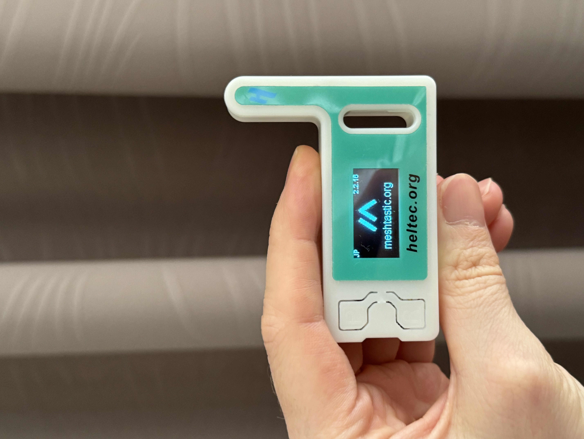
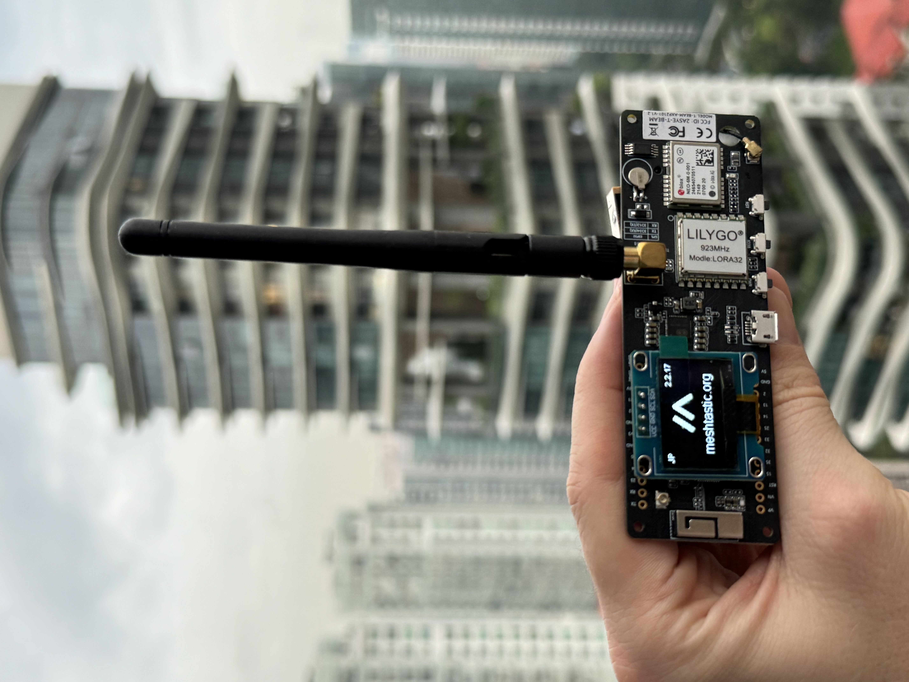
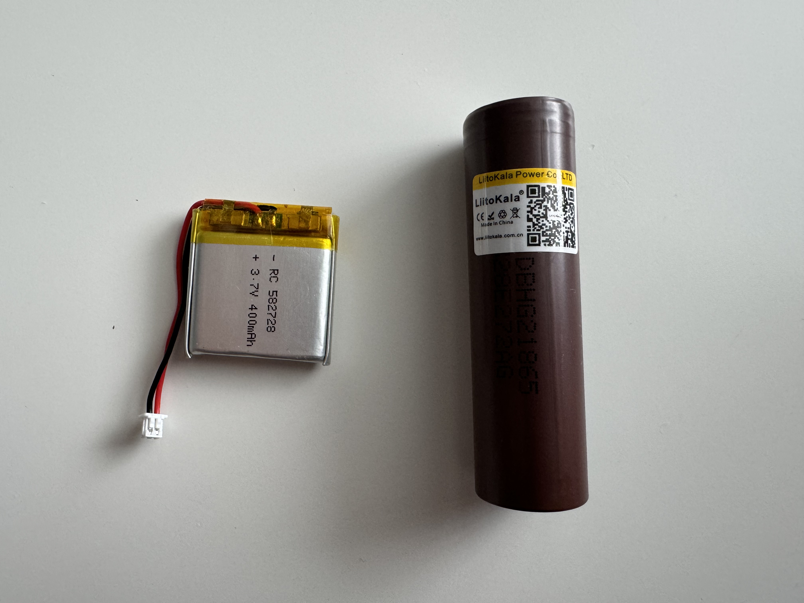
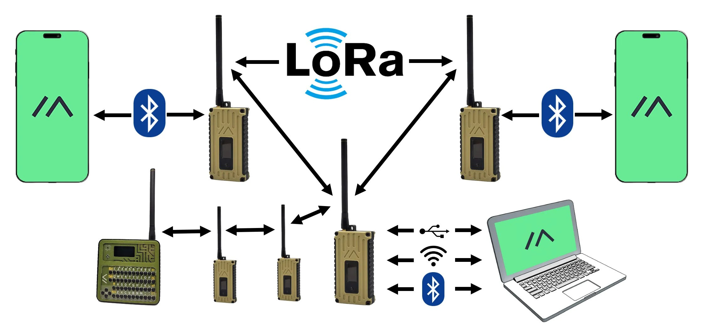
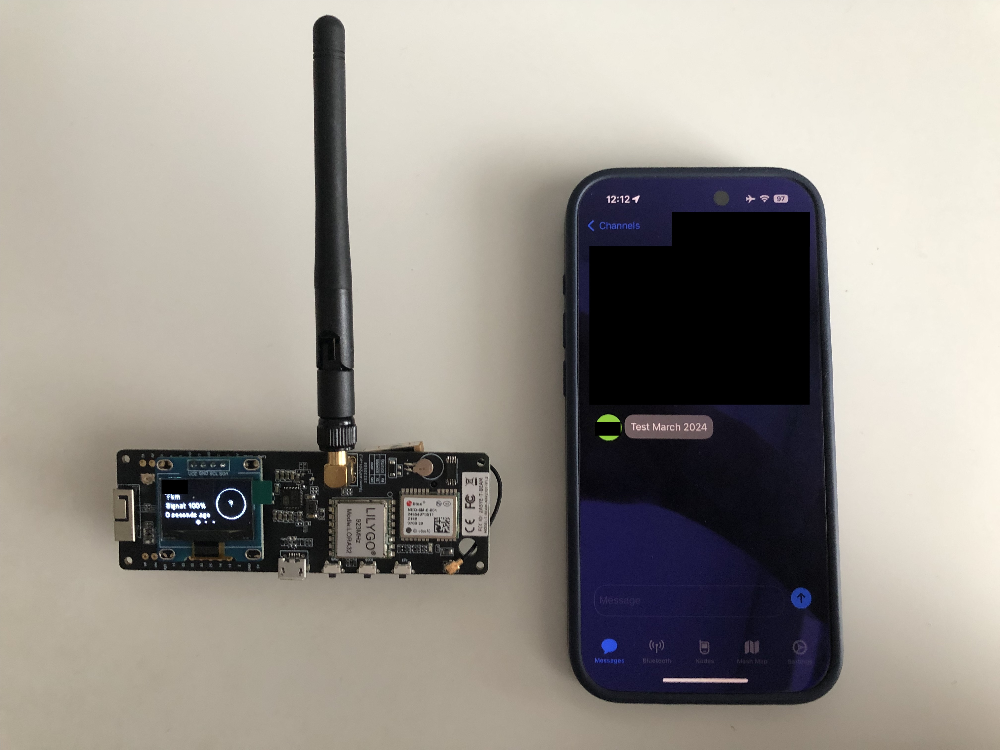

# Building a Multi-Kilometer Texting and GPS Infrastructure Without Using the Internet

Welcome to the [Meshtastic](https://meshtastic.org/) project — an innovative solution aimed at creating a secure, low-power, long-range communication network off the grid using LoRa technology.

Through easy-to-use interfaces and Bluetooth connectivity, smartphones and laptops can interact with the mesh, offering a novel way to stay connected even in the most off-the-grid scenarios. Let's dive into the world of Meshtastic!

## Two Meshtastic devices
By harnessing the Heltec WiFi LoRa 32 (V3) and the LILYGO TTGO T-Beam V1.2 ESP32 devices, I have built a network that allows for the transmission of text messages and GPS locations without the need for cellular data or Wi-Fi.

These devices act as nodes in the network, relaying information between each other, thereby significantly extending the range of direct communication for myself and others. This system is perfect for outdoor adventures, disaster recovery, or any situation where traditional communication infrastructure isn't available.

LoRa's range can vary — expect up to 2-5 km in urban areas, over 20 km in open rural environments and up to 254km ([record by kboxlabs](https://meshtastic.org/docs/overview/range-tests/#current-ground-record-254km)), depending on conditions and antenna setup. Meshtastic harnesses this range to keep you connected, wherever you may be.

Heltec WiFi LoRa 32(V3) Dev-board with SX1262 and ESP32-S3FN8|  LILYGO TTGO Meshtastic T-Beam V1.2 ESP32
:-------------------------:|:-------------------------:
 |

| Feature                 | Heltec WiFi LoRa 32 (V3)                             | LILYGO TTGO T-Beam V1.2                     |
|-------------------------|------------------------------------------------------|---------------------------------------------|
| **Microcontroller**     | ESP32-S3FN8                                          | ESP32                                       |
| **LoRa Chip**           | SX1262                                               | SX1276 (or similar)                         |
| **Frequency Range**     | 863-870MHz (Based on AliExpress)                     | 923MHz (Based on AliExpress)      |
| **WiFi Capability**     | Yes                                                  | Yes                                         |
| **Bluetooth**           | Yes                                                  | Yes                                         |
| **Onboard Display**     | OLED Display                                         | No but it can be added easily                                        |
| **GPS Module**          | No                                                   | Yes, built-in GPS module                    |
| **Power Management**    | Advanced power management for battery operation      | Onboard power management for battery and USB charging |
| **Antenna Connectors**  | IPEX connector for an external antenna               | Connectors for LoRa and GPS antennas        |
| **USB to Serial**       | CP2102                                               | CP210x                                      |
| **Additional Features** | May include sensors and more I/O                     | Built-in battery management, additional I/O pins |
| **Primary Use Case**    | Meshtastic / IoT applications with a need for Wi-Fi and LoRa      | Meshtastic  incl. tracking and portable applications requiring GPS and LoRa |

### Batteries used for this project 

On the left: a 582728 3.7V 400mAh lithium battery for the Heltec device, and on the right: a 18650 HG2 lithium battery for the LILYGO device.

## How does it work?

Meshtastic is a project that leverages LoRa (Long Range) technology to establish a decentralized, long-distance communication network. By using devices like the Heltec LoRa 32 (V3) and LILYGO TTGO T-Beam V1.2, which are equipped with LoRa transceivers, users can send messages to one another without the need for cellular or internet connectivity. These devices form a mesh network, meaning each node can relay messages to other nodes, thereby extending the communication range beyond the individual device's capabilities.

Smartphones and laptops can connect to these LoRa devices via Bluetooth. The Meshtastic software on the smartphone or laptop enables the sending and receiving of text messages, GPS locations, and other data through the mesh network. This type of network is particularly useful in remote areas, during outdoor activities, or in situations where traditional communication infrastructure is unavailable or compromised.

Source: meshtastic.org

### How to install it?

It is super easy if you use the devices from this article or any other [supported device](https://meshtastic.org/docs/hardware/devices/). 

* Connect a LoRa device via USB to your computer.
* Go to https://flash.meshtastic.org/
	* Choose the Device.
	* Select the firmware (ideally the newest stable release).
	* Press Flash	.

## What's next?

- Printing a case for the LILYGO TTGO T-Beam board.
- Making sure more people try it out!
