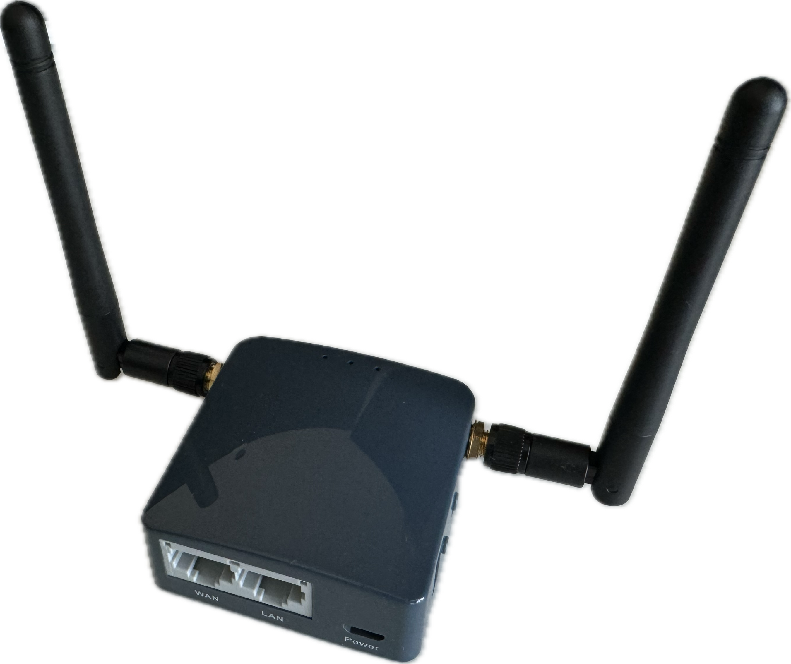

# Travel router

**Empower Your On-the-Go Connectivity with GL.iNet's Smart Routers**

When you're on the move, whether it's at a hotel, a conference, or a café, connecting your devices to a public, potentially unencrypted, and shared wireless network is often unavoidable. Unfortunately, this exposes you to numerous risks. Hackers may intercept your data traffic, steal your account credentials, access sensitive information, or even implant malware on your devices. To reduce these risks, investing in a travel router is highly advisable.

A travel router not only strengthens security but also enhances privacy and streamlines connectivity for you and your family. With just one click, you can ensure that all your devices connect via a fully encrypted VPN, ensuring a seamless, private, and secure internet experience wherever you go. You can easily toggle the VPN on and off using a conveniently placed external button on the device or through the intuitive mobile app interface.

Furthermore, the router acts as a firewall, blocking many requests to your internal network. Additionally, it functions as a [NAT](https://en.wikipedia.org/wiki/Network_address_translation), effectively hiding the internal network and devices from external threats.

Have you ever struggled with weak Wi-Fi signals in your hotel room? This common issue can also be addressed with a travel router, as it can function as a repeater to amplify signal strength, ensuring reliable connectivity throughout your stay.

This article compares two travel routers: the AR300M16, also known as Shadow, and the Spitz 4G router from GL.iNet. Below, we'll focus on the Shadow, which is the smaller of the two routers and ideal for ultra-lightweight traveling. 

The image below illustrates how a travel router can create a barrier between public and private networks on the go, enhance privacy and security with a VPN and [DNS over TLS](https://en.wikipedia.org/wiki/DNS_over_TLS). To ensure nearly constant connectivity by using the Shadow as a 4G gateway for all your devices, and even enable the use of wired networks if wireless connections are congested.

## Travel router network architecture use case (AR300M16 / Shadow)

**Advantages**

* Only the router need to be connected to a new wifi, all your other devices do not need to be re-configured as they always connect to the travel router
* You can tunnel all your communication through a VPN for secure and private internet usage
* You can use a cable based network if the wireless networks are very congested. 
* It is possible to use the router as a gateway to connect to the internet via a cellular 4G network 
* It supports [OpenWRT](https://openwrt.org) which is a open source trusted router platform for advanced router and gateway functionalities
* The router can be controlled via a dedicated [mobile app](https://www.gl-inet.com/app/) which makes it super easy to setup, monitor and easily do configuration changes.
* You [DNS](https://en.wikipedia.org/wiki/Domain_Name_System) requests also can be encrypted which enhances your privacy

## Device comparison

Shadow (AR300M16) | Spitz 4G LTE
:-------------------------:|:-------------------------:
 |

| Feature                              | GL.iNet AR300M16 mini Smart Router (Shadow) | GL.iNet Spitz 4G LTE Smart Router |
|--------------------------------------|---------------------------------|-----------------------------------|
| Wireless Standard                    | 802.11b/g/n                     | 802.11a/b/g/n/ac                  |
| Ethernet Ports                       | 1 WAN, 1 LAN                    | 1 WAN, 1 LAN                      |
| Wi-Fi Speed                          | Up to 300Mbps (2.4GHz)          | Up to 300Mbps (2.4GHz), 433Mbps (5GHz)|
| SIM Card Slot                        | No                              | Yes                               |
| LTE Support                          | Yes (with external USB modem or USB smart phone tethering)          | Yes (4G LTE) |
| External Antennas                    | No (depends on the model but can be added, I added it manually)           | Yes          |
| VPN Client/Server Support            | Yes (OpenVPN max. 15 Mbps, WireGuard max. 50 Mbps) | Yes (OpenVPN max. 10 Mbps, WireGuard max. 38 Mbps) |
| USB Ports                            | 1                               | 1                                 |
| Storage                              | No                              | MicroSD Slot (max. 512 GB)        |
| External Storage Sharing             | No                              | Yes                               |
| CPU                                  | QCA9531, @650MHz SoC            | QCA9531@650MHz                    |
| RAM                                  | 128MB DDR2                      | 128MB DDR2                        |
| Flash Memory                         | 16MB NOR Flash                  | 16MB NOR Flash                    |
| Dimensions                           | 58 x 58 x 25 mm                 | 115 x 74 x 22 mm                  |
| Weight                               | 40g                             | 86g                               |
| Power                                | Micro USB                       | DC 12V/1.5A                       |
| Battery                              | No                              | No                                |
| DIY Features							  | PCIe, UART                       | Support CAT4/CAT6 Mini PCIe      |
| Power Consumption					     | <2W                              | <6W                               |
| Price                               | $19 US incl. shipping            | $29 US (used) incl. shipping.     |

## [GL iNET App](https://www.gl-inet.com/app/)

For effortless setup, monitoring, and configuration adjustments on the fly, such as when connecting to a new network while traveling, GL.iNET provides a mobile app available for both iOS and Android smartphones. Below are a few examples of the app's functionalities.

Overview| Options to connect to the internet |  WireGuard VPN clients
:-------------------------:|:-------------------------:|:-------------------------:
 ||

## Conclusion

In today's mobile-centric world, securing your online activities, especially on public Wi-Fi networks, is essential. GL.iNet's travel routers offer a simple yet effective solution to mitigate cybersecurity risks while ensuring seamless connectivity.

The AR300M16 (Shadow) is ideal for ultra-portable use, offering essential functionalities such as VPN encryption, firewall protection, and signal boosting capabilities. Its compact design makes it perfect for travelers seeking lightweight yet robust security.

On the other hand, the Spitz 4G LTE router boasts enhanced performance and 4G LTE support, making it perfect for those who require reliable internet access on the go. With features like VPN encryption, firewall protection, and signal boosting capabilities, it ensures constant connectivity, even in remote locations.

Whether you opt for the AR300M16 (Shadow) or the Spitz 4G LTE router, with these two routers, staying securely connected on the go has never been easier.

